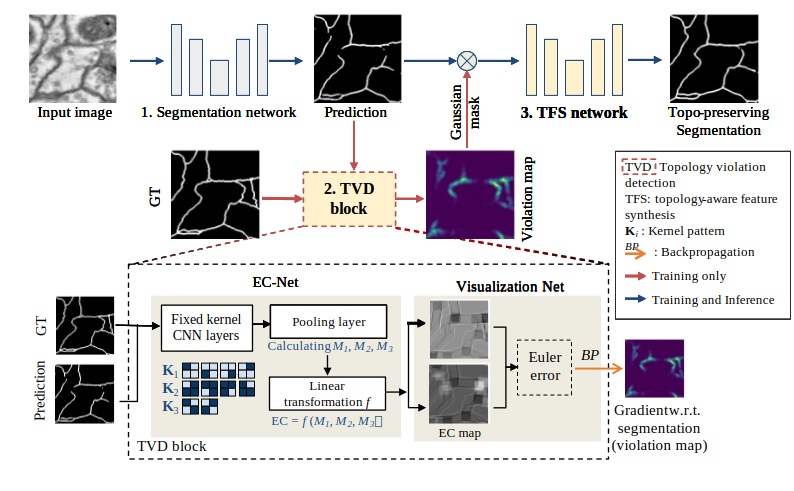

# Topology aware Segmentation using Euler Characteristic
This is the official PyTorch implementation for the paper: Robust Segmentation via Topology Violation Detection and Feature Synthesis, which is accepted in [MICCAI 2023](https://conferences.miccai.org/2023/en/).

Liu Li, Qiang Ma, Cheng Ouyang, Zeju Li, Qingjie Meng, Weitong Zhang, Mengyun Qiao, Vanessa Kyriakopoulou, Joseph V. Hajnal, Daniel Rueckert and Bernhard Kainz.

## Overview
Although modern image segmentation methods show promising results when evaluated based on conventional metrics such as the Dice score or Intersection-over-Union, these metrics do not reflect the correctness of a segmentation in terms of a required topological genus.

In this paper, we propose a fast, deep-learning compatible method for Euler characteristic (EC) calculation and topology-aware segmentation. 

In arbitrary segmentation networks, our EC visualization can inform the topology correctness of the predicted segmentation. Here we provided a plug-and-play topology violation detection (TVD) module to visualize the topological error regions. Topological correction is further facilitated through a post-processing convolutional block, called topology-aware feature synthesis (TFS) network. 


## Dataset
In our paper, the segmentation performance is evaluated on [dHCP-fetal](https://www.developingconnectome.org/) and [CREMI](https://cremi.org/) datasets. 
The data splits for training/validation/testing are given in ```./data/split```. The preprocess code for CREMI dataset is also provided in ```./pre_process_cremi_dataset.py```. We also provide 10 post-processed CREMI samples in each subset for debug and test. 
If you want to train and test on a new dataset, please revise the preprocess and dataloader part.


## Pipeline



### Training
The training process is in two stages. Here we give a simple case to train and test on CREMI dataset, with model name ```EC_1```. 
All configurations for training and test can be set in ```./config.json```.

- Stage 1: train a segmentation model to get an initial prediction. Here we implement a default UNet but this network can be arbitrary SOTA segmentation network. To train our implementation, please run

    ```
    python main.py --phase='train_pre' --train='./data/cremi_2d/train/image/' --train_seg='./data/cremi_2d/train/label/' --TBout='./output/EC_1/pre/' --model='./model/EC_1/pre/' --visual_euler
    ```
    
    ```--train``` The directory of training images
    
    ```--train_seg``` The directory of training labelmaps
    
    ```--TBout``` The directory to save tensorboard output files
    
    ```--model``` The directory to save trained model parameters
    
    ```--visual_euler``` Run topology violation detection (TVD) block during training to visualize the topological errors. Default False, which is more computational efficient. 


- Stage 2: train the postprocessing TFS network to correct the topology error. During training, the input of TFS is the softmax prediction and the EC error maps from the first segmentation network. 
In order to save GPU memory and shorten training time, we first generate an offline training set for this stage, by running the inference of the first segmentation network on both the training and validation sets, and then save softmax and EC error maps:
    ```
    python main.py --phase='test_pre' --test='./data/cremi_2d/train/image/' --test_seg='./data/cremi_2d/train/label/' --trained_model_pre='./model/EC_1/pre/' --out='./data/cremi_2d/train/' --visual_euler
    ```
  
    ```
    python main.py --phase='test_pre' --test='./data/cremi_2d/test/image/' --test_seg='./data/cremi_2d/test/label/' --trained_model_pre='./model/EC_1/pre/' --out='./data/cremi_2d/test/' --visual_euler
    ```
  
    ```--test``` The directory of images to be test
    
    ```--test_seg``` The directory of corresponding labelmaps
    
    ```--trained_model_pre``` The directory to load the trained model of stage 1 
    
    ```--out``` The directory to save test results (both images and pkl files). As default, 3 folders will be generated in this directory:  ```softmax```, ```argmax``` and ```ec```

    Then, the post-processing TFS network is trained by running:
    ```
    python main.py --phase='train_post' --train_ec='./data/cremi_2d/train/ec/' --train_softmax='./data/cremi_2d/train/softmax/' --train_seg='./data/cremi_2d/train/label/' --val_ec='./data/cremi_2d/test/ec/' --val_softmax='./data/cremi_2d/test/softmax/'  --val_seg='./data/cremi_2d/test/label/' --TBout='./output/EC_1/post/' --model='./model/EC_1/post/' --visual_euler
    ```
  
    ```--train_ec``` and ```--val_ec``` The directory of EC error maps from the stage 1 segmentation network, as input
    
    ```--train_softmax``` and ```--val_softmax```  The directory of softmax predictions from the stage 1 segmentation network, as input

    ```--train_seg``` and ```--val_seg``` The directory of labelmaps, as groundtruth or for evaluation

    ```--TBout``` The directory to save tensorboard output files
    
    ```--model``` The directory to save trained model parameters


### Test
- To end-to-end test and save the prediction results from both stages, please run 
    ```
    python main.py --phase='test' --test='./data/cremi_2d/test/image/' --test_seg='./data/cremi_2d/test/label/' --trained_model_pre='./model/EC_1/pre/' --trained_model_post='./model/EC_1/post/' --out='./output/EC_1/' --TBout='./output/EC_1/'
    ```
    
    ```--test``` The directory of test images
    
    ```--test_seg``` The directory of test labelmaps

    ```--trained_model_pre``` The directory to load the trained stage 1 model 

    ```--trained_model_post``` The directory to load the trained stage 2 model 

    ```--out``` The directory to save test results. It will save the segmentation results from both stage 1 and stage 2 in folder ```pre``` and ```post```, respectively. 


- If you want to only test on either stage 1 or stage 2 (with softmax and EC error map from stage 1 already saved), you can run following code directly:

    ```
    python main.py --phase='test_pre' --test='./data/cremi_2d/test/image/' --test_seg='./data/cremi_2d/test/label/' --trained_model_pre='./model/EC_1/pre/' --out='./output/EC_1/pre/' --TBout='./output/EC_1/pre/'
    ```

    ```
    python main.py --phase='test_post' --test_ec='./data/cremi_2d/test/ec/' --test_softmax='./data/cremi_2d/test/softmax/' --test_seg='./data/cremi_2d/test/label/' --trained_model_post='./model/EC_1/post/'  --out='./output/EC_1/post/' --TBout='./output/EC_1/post/'
    ```
  
    ```--test_ec```The directory of test EC error maps from the stage 1 segmentation network 
    
    ```--test_softmax``` The directory of test softmax predictions from the stage 1 segmentation network


### Plug-and-play: visualize topological error

- A plug-and-play module to test the topological errors between any predictions and ground-truth without training, please run: 
    ```
    python main.py --phase='euler_visualization' --ec_pred='./data/cremi_2d/test/softmax/' --ec_gt='./data/cremi_2d/test/label/' --subpatch_size=32 --subpatch_stride=1 --TBout='./output/EC_1/euler/' --out='./output/EC_1/euler/'
    ```
  
    ```--pred``` The directory of predictions as the input of TVD block
    
    ```--gt``` The directory of ground-truth as the input of TVD block

    ```--ec_output``` The directory to save the output from TVD block: topological error maps

    ```--subpatch_size``` and ```--subpatch_stride``` The hyperparameters for local Euler characteristic calculation, which varies from datasets to datasets


## Installation
This repo is build based on [PyTorch](https://pytorch.org/) and [GUDHI](https://gudhi.inria.fr/) (for topology calculation) libraries. The dependencies can be installed by running the following codes. Note that the PyTorch version is chosen by my GPU (NVIDIA GeForce RTX 3080) and cuda version. Please check if this setting also works for your environment from [PyTorch documents](https://pytorch.org/get-started/previous-versions/).

```
conda create --name euler-segmentation python=3.6
conda activate euler-segmentation
pip install torch==1.8.0+cu111 torchvision==0.9.0+cu111 -f https://download.pytorch.org/whl/torch_stable.html
pip install -r requirements.txt 
pip install -U git+https://github.com/shizuo-kaji/CubicalRipser_3dim
```

## Contact
If you have any questions, please feel free to email liu.li20@imperial.ac.uk


